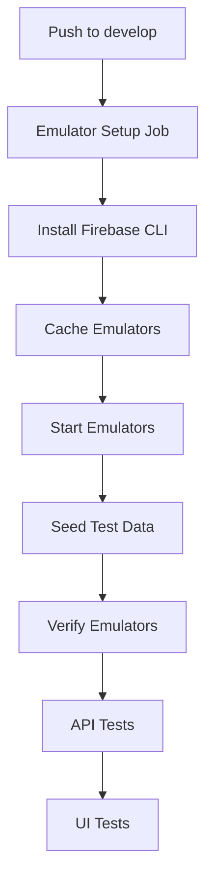
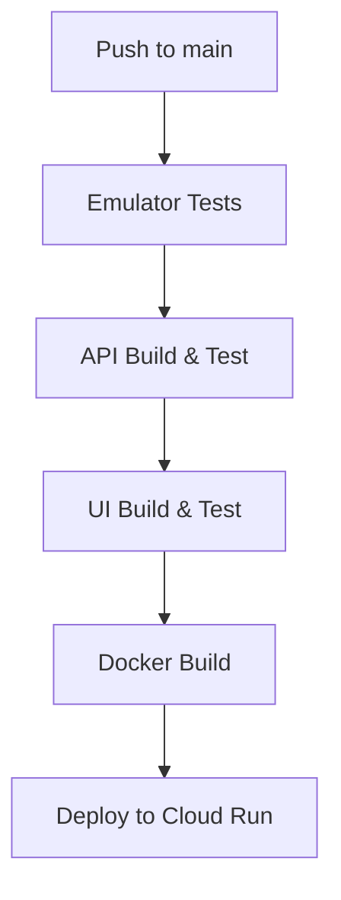

# Phase 4: CI/CD with Firebase Emulators - Complete! ✅

## What Was Done

### 1. Updated CI Workflow (`.github/workflows/ci.yml`)

**New Structure:**
- ✅ **Emulator Setup Job**: Installs Firebase CLI, caches emulators, starts emulators
- ✅ **Seed Test Data**: Runs seed script to populate emulators
- ✅ **API Tests**: Lint, typecheck, E2E with emulators
- ✅ **UI Tests**: Lint, typecheck, unit tests, Playwright E2E with emulators

**Key Improvements:**
- Firebase emulators now run in CI/CD
- Test data automatically seeded before tests
- All tests run against emulators (not mocks)
- Emulator caching for faster builds
- Environment variables set for emulator connection
- Proper wait logic for emulator readiness

### 2. Updated Deploy Workflow (`.github/workflows/deploy.yml`)

**New Pre-Deploy Testing:**
- ✅ **Emulator Tests Job**: Validates API with emulators before deployment
- ✅ Runs lint and typecheck against emulator environment
- ✅ Ensures production-like testing before deploy

### 3. Emulator Configuration in CI

**Environment Variables Set:**
```yaml
# API Job
FIRESTORE_EMULATOR_HOST: localhost:8889
FIREBASE_AUTH_EMULATOR_HOST: localhost:9099
FIREBASE_PROJECT_ID: demo-gsdta

# UI Job
NEXT_PUBLIC_AUTH_MODE: firebase
NEXT_PUBLIC_USE_MSW: false
NEXT_PUBLIC_FIREBASE_API_KEY: demo-key
NEXT_PUBLIC_FIREBASE_AUTH_DOMAIN: localhost
NEXT_PUBLIC_FIREBASE_PROJECT_ID: demo-gsdta
NEXT_PUBLIC_FIREBASE_APP_ID: demo-app
NEXT_PUBLIC_FIREBASE_AUTH_EMULATOR_HOST: localhost:9099
NEXT_PUBLIC_FIRESTORE_EMULATOR_HOST: localhost:8889
```

## How It Works

### CI Workflow (develop branch)



**Flow:**
1. **Emulator Setup**: Starts Firebase emulators, waits for readiness
2. **Seed Data**: Populates with test users, students, invites
3. **API Tests**: Runs against seeded emulators
4. **UI Tests**: Runs Playwright tests against seeded emulators

### Deploy Workflow (main branch)



**Flow:**
1. **Emulator Tests**: Quick validation with emulators
2. **Build & Test**: Full test suite
3. **Docker**: Build production image
4. **Deploy**: Push to Cloud Run

## Key Features

### ✅ Emulator Caching
```yaml
- name: Cache Firebase Emulators
  uses: actions/cache@v4
  with:
    path: ~/.cache/firebase/emulators
    key: ${{ runner.os }}-firebase-emulators-${{ hashFiles('firebase.json') }}
```

**Benefit:** Faster CI runs (emulators downloaded once)

### ✅ Automatic Seeding
```yaml
- name: Seed test data
  run: |
    export FIRESTORE_EMULATOR_HOST=localhost:8889
    export FIREBASE_AUTH_EMULATOR_HOST=localhost:9099
    npm run seed
```

**Benefit:** Consistent test data in every CI run

### ✅ Wait for Emulator Readiness
```yaml
for i in {1..30}; do
  if curl -s http://localhost:4445 > /dev/null 2>&1; then
    echo "Emulators ready!"
    break
  fi
  sleep 2
done
```

**Benefit:** Prevents race conditions

### ✅ Production-Like Testing
```yaml
env:
  NEXT_PUBLIC_AUTH_MODE: firebase
  NEXT_PUBLIC_FIREBASE_AUTH_EMULATOR_HOST: localhost:9099
```

**Benefit:** Tests run in firebase mode (not mock mode)

## Testing the Workflows Locally

### Simulate CI Environment

**Using Act (GitHub Actions locally):**
```bash
# Install act
brew install act

# Run CI workflow
act push -W .github/workflows/ci.yml

# Run specific job
act -j api
```

**Manual Simulation:**
```bash
# 1. Start emulators
firebase emulators:start --project demo-gsdta &

# 2. Seed data
npm run seed

# 3. Run API tests
cd api
export FIRESTORE_EMULATOR_HOST=localhost:8889
export FIREBASE_AUTH_EMULATOR_HOST=localhost:9099
npm ci
npm run lint
npm run typecheck
npm run test:e2e

# 4. Run UI tests
cd ../ui
npm ci
npm run lint
npm run typecheck
npm test
npm run e2e:ci
```

## Benefits

### 1. Production Parity in CI
- ✅ Tests run against Firebase emulators (not mocks)
- ✅ Same authentication flows as production
- ✅ Same database operations as production
- ✅ Catches emulator-specific bugs before deployment

### 2. Faster Feedback
- ✅ Emulator caching reduces build time
- ✅ Parallel job execution where possible
- ✅ Early failure detection

### 3. Cost Savings
- ✅ No cloud Firebase resources consumed in CI
- ✅ No test data persisted in production databases
- ✅ Unlimited test runs without cost

### 4. Reproducibility
- ✅ Same test data every time (via seed script)
- ✅ Isolated test environment
- ✅ No flaky tests from shared state

## CI Workflow Details

### Job: emulator-setup

**Purpose:** Prepare emulator environment for downstream jobs

**Steps:**
1. Checkout code
2. Setup Node.js
3. Install Firebase CLI
4. Cache emulators (for speed)
5. Start emulators
6. Wait for readiness
7. Install seed script deps
8. Seed test data
9. Verify emulators accessible

**Duration:** ~2-3 minutes (first run), ~1-2 minutes (cached)

### Job: api

**Purpose:** Test API code with emulators

**Environment:**
- `FIRESTORE_EMULATOR_HOST: localhost:8889`
- `FIREBASE_AUTH_EMULATOR_HOST: localhost:9099`
- `FIREBASE_PROJECT_ID: demo-gsdta`

**Steps:**
1. Checkout
2. Setup Node.js with cache
3. Install Firebase CLI
4. Start emulators
5. Seed data
6. Install API dependencies
7. Lint
8. Typecheck
9. E2E tests (Cucumber)

**Duration:** ~3-5 minutes

### Job: ui

**Purpose:** Test UI code with emulators

**Environment:**
- Firebase mode enabled
- Emulator hosts configured
- Demo project ID

**Steps:**
1. Checkout
2. Setup Node.js with cache
3. Install Firebase CLI
4. Start emulators
5. Seed data
6. Install UI dependencies
7. Lint
8. Typecheck
9. Unit tests
10. E2E tests (Playwright)

**Duration:** ~5-7 minutes

**Total CI Duration:** ~10-15 minutes

## Deploy Workflow Updates

### New Job: emulator-tests

**Purpose:** Quick validation before deployment

**What it tests:**
- API lint & typecheck with emulator environment
- Ensures code works with Firebase emulators
- Catches configuration issues early

**Duration:** ~2-3 minutes

### Integration with Existing Jobs

```yaml
jobs:
  emulator-tests:  # NEW - quick validation
    ...
  
  api:
    needs: emulator-tests  # Depends on emulator tests
    ...
  
  ui:
    needs: api
    ...
  
  docker:
    needs: ui
    ...
  
  deploy:
    needs: docker
    ...
```

## Environment Variable Strategy

### CI Environment (develop)
```yaml
# Emulators for testing
FIRESTORE_EMULATOR_HOST: localhost:8889
FIREBASE_AUTH_EMULATOR_HOST: localhost:9099
FIREBASE_PROJECT_ID: demo-gsdta

# Client config
NEXT_PUBLIC_AUTH_MODE: firebase
NEXT_PUBLIC_FIREBASE_API_KEY: demo-key
NEXT_PUBLIC_FIREBASE_AUTH_EMULATOR_HOST: localhost:9099
```

### Production Environment (main)
```yaml
# Real Firebase (from secrets)
NEXT_PUBLIC_AUTH_MODE: firebase
NEXT_PUBLIC_FIREBASE_API_KEY: ${{ secrets.FIREBASE_API_KEY }}
NEXT_PUBLIC_FIREBASE_AUTH_DOMAIN: ${{ secrets.FIREBASE_AUTH_DOMAIN }}
# No emulator hosts = connects to production
```

## Troubleshooting CI Issues

### Issue: Emulators not starting

**Check:**
```yaml
- name: Debug emulators
  run: |
    firebase emulators:start --project demo-gsdta --only auth,firestore &
    sleep 5
    curl -v http://localhost:4445
    curl -v http://localhost:9099
    curl -v http://localhost:8889
```

### Issue: Seed script fails

**Check:**
```yaml
- name: Debug seed
  run: |
    cd scripts
    npm ci
    npm run seed
  env:
    FIRESTORE_EMULATOR_HOST: localhost:8889
    FIREBASE_AUTH_EMULATOR_HOST: localhost:9099
```

### Issue: Tests can't connect to emulators

**Verify environment variables:**
```yaml
- name: Check env
  run: |
    echo "FIRESTORE_EMULATOR_HOST=$FIRESTORE_EMULATOR_HOST"
    echo "FIREBASE_AUTH_EMULATOR_HOST=$FIREBASE_AUTH_EMULATOR_HOST"
```

### Issue: Cache not working

**Clear cache:**
- Go to GitHub repo → Actions → Caches
- Delete `firebase-emulators` cache
- Re-run workflow

## Security Considerations

### ✅ No Real Firebase Credentials in CI
- Emulators don't need credentials
- Production credentials only used in deploy job
- Secrets isolated to deployment

### ✅ Isolated Test Environment
- Each CI run gets fresh emulators
- No shared state between runs
- No data persistence

### ✅ Demo Project ID
- `demo-gsdta` clearly indicates test environment
- Can't accidentally connect to production

## Performance Optimizations

### 1. Emulator Caching
```yaml
uses: actions/cache@v4
with:
  path: ~/.cache/firebase/emulators
```
**Saves:** ~30-60 seconds per build

### 2. npm Cache
```yaml
uses: actions/setup-node@v4
with:
  cache: 'npm'
```
**Saves:** ~20-40 seconds per job

### 3. Parallel Jobs
```yaml
jobs:
  api:    # Can run after emulator-setup
  ui:     # Must wait for api
```
**Saves:** Sequential where safe, parallel where possible

### 4. Seed Script Efficiency
- Idempotent operations
- Batch Firestore writes
- Minimal console output

## What's Next

Phase 4 is complete! CI/CD now uses Firebase emulators. Next:

**Phase 5: Deprecate Mock Mode**
- Remove MSW handlers
- Remove mock authentication
- Simplify `AuthProvider`
- Clean up environment variables
- Update all documentation

## Success Metrics

- ✅ CI runs with Firebase emulators
- ✅ Test data seeded automatically
- ✅ All tests pass against emulators
- ✅ No cloud Firebase costs in CI
- ✅ Faster than before (with caching)
- ✅ Production-like test environment
- ✅ Deploy workflow includes emulator validation

---

**Phase 4 Status**: ✅ **COMPLETE**

**CI/CD Integration:**
- Phase 1 (Infrastructure) ✅
- Phase 2 (Client Integration) ✅
- Phase 3 (Seed Scripts) ✅
- Phase 4 (CI/CD) ✅
- Phase 5 (Cleanup) ⏭️

**Ready for Phase 5**: Yes - Time to deprecate mock mode and simplify!
