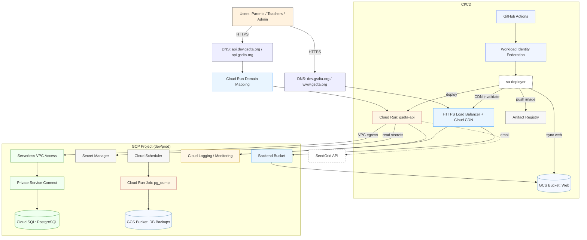
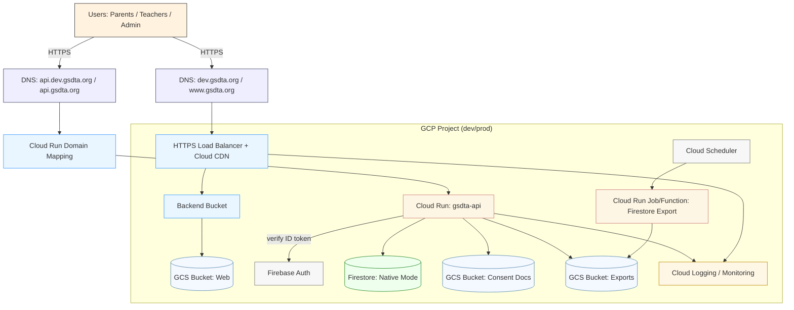

# GSDTA — Architecture Diagrams

This document provides high-level architecture diagrams aligned with the README (2025 stack) and the MVP requirements.
Two diagrams are included:

- Primary (2025 stack): Next.js static on GCS + Cloud CDN, Go API on Cloud Run, PostgreSQL on Cloud SQL, OIDC, CI/CD via
  GitHub Actions OIDC
- MVP alternative (requirements path): Firestore + Firebase Auth

## 1) Primary Architecture — GCS+CDN, Cloud Run, Cloud SQL (OIDC)

### Data/Control Flows

- Web: Browser → DNS → HTTPS LB + CDN → Backend Bucket → GCS Web Bucket
- API: Browser/UI → DNS api → Cloud Run → Secret Manager + Cloud SQL via VPC (private IP)
- CI/CD: GitHub Actions (OIDC) → impersonate sa-deployer → push image (Artifact Registry), deploy API, sync web,
  invalidate CDN
- Backups: Cloud Scheduler → Cloud Run Job → pg_dump → GCS backups bucket
- Observability: Logs/metrics from LB and API → Cloud Logging/Monitoring

## 2) MVP Alternative — Firestore + Firebase Auth

## Legend

- Edge: DNS, HTTPS Load Balancer, Cloud CDN, domain mappings
- Compute: Cloud Run services/jobs
- Storage: GCS buckets (web, backups, consent, exports)
- DB: Cloud SQL (Postgres) or Firestore (alt)
- Network: Serverless VPC Access and Private Service Connect
- Management: Secret Manager, Scheduler, Artifact Registry
- CI/CD: GitHub Actions with Workload Identity Federation and a deploy service account
- External: SendGrid

References

- See `infra.md`, `ui.md`, and `api-db.md` in this folder for detailed steps and acceptance criteria.
